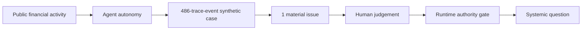

# REGULATOR//GHOST

**Where does intelligence end and authority begin?**

REGULATOR//GHOST is a presenter-led decision theatre for financial-services audiences. It places one reproducible, **synthetic teaching simulation** inside three real-world arcs: capital-markets operations, agentic transactions, and correlated investment decisions. The public examples are documented in [PUBLIC_SOURCES.md](PUBLIC_SOURCES.md); they are context, **not claims that this demo is deployed**.

## The idea in 30 seconds

One synthetic failed trade opens an investigation. Eight agents create 27 sub-tasks and 486 trace events in 3.2 simulated seconds. A material entity reclassification is logged but buried. Asking a person to approve the whole trace produces **ON WHAT BASIS?** A separate simulated Supervisory AI links the one event that matters to a proposed restriction. The human can then judge the disputed fact and consequence. Even with a risk coefficient of 76 and illustrative 74% prediction, the runtime gate says **ESCALATE**: intelligence has not created authority.



## The three arcs

| Arc | Public grounding | Question on stage |
| --- | --- | --- |
| Capital-markets operations | Broadridge reports production exception workflows; Standard Chartered describes an illustrative failed-trade agent workflow. | If one exception generates hundreds of machine actions, what can a human meaningfully review? |
| Payments and digital assets | Sygnum reports a controlled live-mainnet pilot with client signing; payment networks report pilots and rollouts; BIS/MAS research programmable compliance. | What can an agent prepare, initiate or execute, and under whose mandate? |
| Asset management | IOSCO and the FSB discuss AI use and vulnerabilities; BIS Project Logos studies correlated portfolio agents in simulation. | Could individually compliant agents create a collective outcome no one intended? |

Source maturity and important qualifications are in [PUBLIC_SOURCES.md](PUBLIC_SOURCES.md). The synthetic failed-trade case is **not** a claim that any named firm, regulator or market has experienced this sequence.

## Main show

Eight escalating audience beats, 27 presenter advances: answers → actions; agents help but humans lose the thread; AI supervises AI but allocates human attention; prediction is not permission; one disputed fact changes the case; human judgement and the runtime authority gate; individually correct agents create systemic effects; the ghost. The causal case is **one stage with three reveals** after the no-breach moment: a coherent explanation (classification → 39→76 → recommendation), a separate source and Bank Compliance challenge, then an animated 76→39 counterfactual. The challenge does not make the second AI correct. The show then asks what verification human judgement needs before the single **ESCALATE** verdict.

The on-stage authority ladder is **ASSIST → INVESTIGATE → ASSESS → ACT**; supervision is a later meta-control, not another rung. A restrained corner indicator tracks the AI role and either its human benefit or its governance question. Main-stage detail controls say **SHOW MORE**; the drawers retain precise evidence and source language.

Beat 7 then asks what happens when individual controls work. Six hypothetical portfolio agents, each within mandate but optimising for a different constraint, respond independently to a shared market signal. Their first actions may change the market conditions they observe; feedback can prompt a stronger second wave. The changed market may then transmit pressure in parallel through funding/leverage, collateral and settlement/cash channels, rather than through one inevitable serial chain. This persistent-stage sequence is **OPTIMISE → FEEDBACK → TRANSMIT → SYSTEM CHANGED → WHO SUPERVISES THE SYSTEM?** It is a **regulatory-research / synthetic illustration**, not a reported incident or a second executable scenario. That qualification is kept here, in source notes and evidence detail, rather than on the audience-facing stage. Ghost ends on **WHERE DOES INTELLIGENCE END AND AUTHORITY BEGIN?**

The important event, `EntityGraph/T-17` (`EVT-0238`), is truly in the 486-trace-event stream. It changes a *derived* classification from central-bank-related to commercial-counterparty. A linked score update moves **39 → 76**; an institutional challenge supports a **76 → 39** counterfactual. The original source is never overwritten. The Supervisory AI finding cites the exact classification, score, recommendation and mandate-boundary events. Evidence, trust controls and the complete run remain available in contextual drawers and export.

The human-in-the-right-loop distinction is concrete: a person should not be asked to approve 486 undifferentiated machine actions. They should own the consequential judgement, while recognising that contested evidence may still need manual verification or AI-assisted validation. Human authority is not automatic certainty. The Supervisory AI is itself an **attention allocator**: its provenance, uncertainty, contestability, independence, disagreement, causal trace, reproducibility and limited authority are inspectable.

## Run locally

Requires Node.js 20 or newer. No installation, API key, live LLM, market feed or network connection is needed.

```sh
npm run dev
```

Open [http://127.0.0.1:4173](http://127.0.0.1:4173). If that port is occupied, use `PORT=4174 npm run dev`. Stop the server with Ctrl-C. Run `npm test` for deterministic scenario and presentation-state checks.

| Control | Action |
| --- | --- |
| Right arrow / Space | Next reveal |
| Left arrow | Previous reveal |
| R | Reset the current beat, or replay its active animation |
| E | Open contextual evidence where available |
| P | Pause or resume an animation |
| F | Toggle fullscreen |
| Esc | Close the detail drawer |
| Home | Reset the show |

The discreet on-screen arrows work too. **AUTHORISE / REJECT** in the naive-review moment are interactive teaching controls: neither records approval; both lead to **ON WHAT BASIS?** Evidence controls appear only where relevant. The drawer exports the full synthetic run.

## Architecture and boundaries

- [src/scenario.mjs](src/scenario.mjs): deterministic synthetic run, evidence links, causal reconstruction, counterfactual and authority gate.
- [src/presentation.mjs](src/presentation.mjs): eight beats with presenter-controlled micro-reveals and non-executing naive-review logic.
- [src/theatre.mjs](src/theatre.mjs): projection stage, actual event replay, keyboard controls and evidence drawer.
- [styles.css](styles.css): dark, low-chrome 16:9 theatre; the main stage does not scroll at desktop projection size.
- [tests/](tests/): trace, gate and presentation-state assertions. [scripts/dev-server.mjs](scripts/dev-server.mjs) uses Node alone.

The runtime gate distinguishes a deterministic prohibited transaction from a probabilistic proposed restriction. In the main run, **no rule has been breached**, evidence is disputed and the simulated agent has recommendation—not execution—authority. **ESCALATE** means the restriction is not executed. The gate is a teaching model, not a legal decision engine or implementation of a public framework.

## Evidence maturity and limitations

The source notes and evidence detail distinguish **LIVE PRODUCTION**, **LIVE PILOT**, **OFFICIAL PROTOTYPE**, **REGULATORY RESEARCH** and **SYNTHETIC TEACHING SIMULATION**; these labels are deliberately absent from the main stage. Commercial labels describe the linked public examples, not this software. The six-agent optimise/feedback/transmit sequence is a synthetic mechanism-of-concern, **not an observed production incident**. Metric gaming remains an optional future **SYNTHETIC RED-TEAM TEST**, not part of the main show.

Trace records use `EVT-XXXX` sequence IDs and stable demo-local `AGT-…` identities. The identity format is inspired by registered-agent governance ideas; it is **not** a MAS SAFR naming convention. A trace event is telemetry/audit instrumentation, not necessarily a model deliberation or external API call. SHOW MORE exposes the actor, mandate, task, parent event and evidence source.

All entities, transactions, scores, percentages, timings and case events in the core run are invented. The 74% prediction is illustrative, not calibrated analytics or a regulatory threshold. The Supervisory AI is deterministic simulated logic, not a live independent AI model. Event fingerprints are stable demo identifiers, not cryptographic proof. This repository contains no real transaction or client data, employer-confidential material or internal policy text. It is **not a production supervisory platform, legal or regulatory advice, or an endorsement by Broadridge, Standard Chartered, Sygnum, BIS, MAS, FSB, IOSCO, IMDA or any employer**.

## Licence and contributions

No open-source licence has been selected. Public availability does not imply unrestricted reuse; see [GitHub's licensing guidance](https://docs.github.com/en/repositories/managing-your-repositorys-settings-and-features/customizing-your-repository/licensing-a-repository). Licence selection remains an explicit project decision. Suggestions are welcome through issues; do not submit confidential information.

For the underlying design intent, see the [build contract](00_README.md), [storyboard](01_storyboard.md) and [evaluation plan](07_eval_harness.md).
