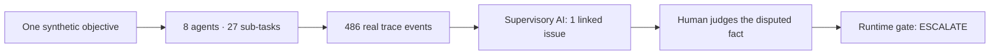

# REGULATOR//GHOST

**Where should human judgement sit in a machine-speed financial system?**

REGULATOR//GHOST is a 3–5 minute, presenter-led decision theatre for a financial-services audience. One synthetic supervisory objective expands into eight agents, 27 sub-tasks and 486 events in 3.2 seconds. A separate supervisory control identifies one material issue and hands a specific judgement to a human. The runtime gate then shows where delegated authority stops.

This is a **synthetic teaching simulation**. It is not a production supervisory system, legal or regulatory advice, or calibrated predictive analytics.

## The idea in 30 seconds

AI first helps a person read. Then an agent chooses its own investigative checks. At machine speed, a complete audit trail becomes too large for a human to supervise action by action. A separate Supervisory AI selects the material issue—but that makes it an attention allocator whose own finding must be traceable and challengeable. A risk score of 76 and an illustrative 74% prediction do not create authority to restrict activity. The runtime disposition is **ESCALATE**; the proposed restriction is not executed.



## What the audience sees

The ten beats move from AI assistance to autonomous observation, agent investigation, parallel expansion, human review overload, AI supervising AI, contestability, predictive intervention, counterfactual and runtime authority, then the closing ghost question. Each beat uses small presenter-controlled reveals. The stage is designed for 1920×1080 projection, with optional evidence drawers for deeper questions.

The flood is generated from the same deterministic run as the later explanation. `EntityGraph/T-17` genuinely changes Entity X's *derived* classification from central-bank-related to commercial-counterparty. A linked risk update moves 39 → 76. The original source remains intact. A Bank Compliance challenge supports the 76 → 39 counterfactual. The Supervisory AI finding cites the exact classification, score, recommendation and mandate events.

## Run locally

Requires Node.js 20 or newer. No dependency install, live model, API key, market feed or external network access is needed.

```sh
npm run dev
```

Open [http://127.0.0.1:4173](http://127.0.0.1:4173). If that port is already in use, stop the existing server or run `PORT=4174 npm run dev` and open port 4174. Stop the server with Ctrl-C.

| Control | Action |
| --- | --- |
| Right arrow / Space | Next reveal |
| Left arrow | Previous reveal |
| R | Replay the current animated reveal |
| P | Pause or resume the current animation |
| F | Enter or leave fullscreen |
| Esc | Close a detail drawer |
| Home | Reset the presentation |

The small on-screen arrows provide the same forward/back controls. The naive **AUTHORISE / REJECT** buttons are deliberately interactive: either leads to **ON WHAT BASIS?** and neither records approval. Contextual detail controls open original events, evidence, trust controls and the gate; the drawer can export the complete synthetic run.

## How it is built

- [src/scenario.mjs](src/scenario.mjs) creates the deterministic run, causal event links, supervisory finding and runtime disposition.
- [src/presentation.mjs](src/presentation.mjs) defines ten audience beats and their internal reveals.
- [src/theatre.mjs](src/theatre.mjs) renders the stage, handles presenter input, replays the actual event stream and exposes drill-down evidence.
- [styles.css](styles.css) supplies the dark, low-chrome projection layout. [scripts/dev-server.mjs](scripts/dev-server.mjs) serves local files with Node alone.
- `npm test` runs the scenario and presentation-state checks.

The gate separates a deterministic prohibited transaction from a probabilistic restriction proposal. In the main run, no rule has been breached. The proposed action exceeds autonomous mandate, concerns a material intervention and has disputed evidence, so it remains unexecuted and goes to a human. The human's task is to judge the reclassification and whether intervention is justified—not to approve 486 undifferentiated events.

## Evidence status and limits

The main path is labelled **SYNTHETIC TEACHING SIMULATION** on screen. Future optional scenarios should carry explicit evidence-status labels: **LIVE PRODUCTION**, **LIVE PILOT**, **OFFICIAL PROTOTYPE**, **REGULATORY RESEARCH** or **SYNTHETIC STRESS TEST**. These labels describe evidence maturity; they are not claims about this demo.

All entities, transactions, scores, predictions, timings and events here are invented. The 74% figure is illustrative, not a calibrated probability or regulatory threshold. The Supervisory AI is a deterministic simulated control, not a deployed independent model. Demo event fingerprints are stable identifiers, not cryptographic proof. No employer, regulator or public body endorses this implementation. It contains no real client or institution data and makes no claim of operational supervisory capability.

## Public inspirations

The concept is inspired by public work on SupTech, AI risk governance and financial stability, including the [BIS Financial Stability Institute's SupTech study](https://www.bis.org/publications/fsi-insight-37-suptech-tools-prudential-supervision-and-their-use-during-pandemic), the [NIST AI Risk Management Framework](https://www.nist.gov/itl/ai-risk-management-framework), and the [FSB's report on AI and financial stability](https://www.fsb.org/2024/11/fsb-assesses-the-financial-stability-implications-of-artificial-intelligence/). These are conceptual references, not specifications for this simulation or endorsements of it.

## Licence and contributions

No open-source licence has been selected or added. Public visibility alone does not make this an open-source release; [GitHub's licensing guidance](https://docs.github.com/en/repositories/managing-your-repositorys-settings-and-features/customizing-your-repository/licensing-a-repository) explains the distinction. Licence selection is an open project decision. Suggestions are welcome through issues; please do not include confidential information.

The [build contract](00_README.md), [storyboard](01_storyboard.md) and [evaluation plan](07_eval_harness.md) provide the full design rationale.
